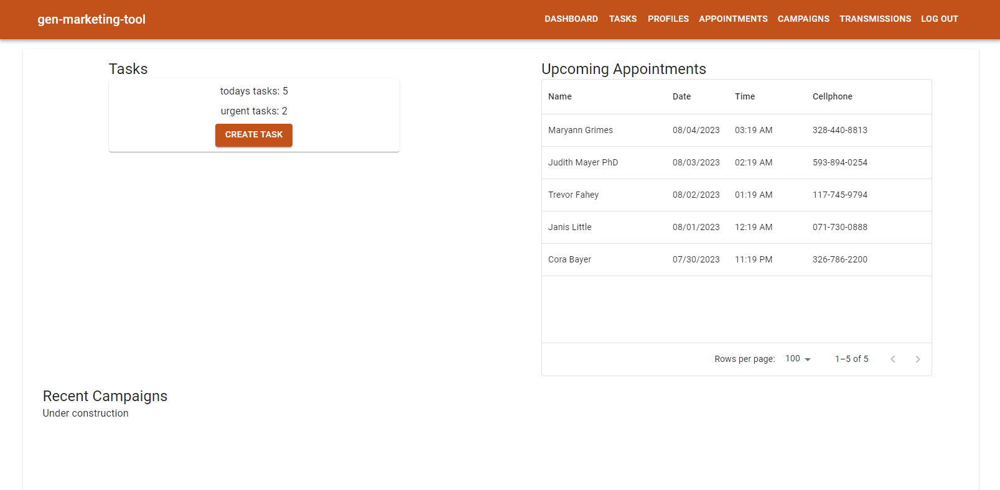
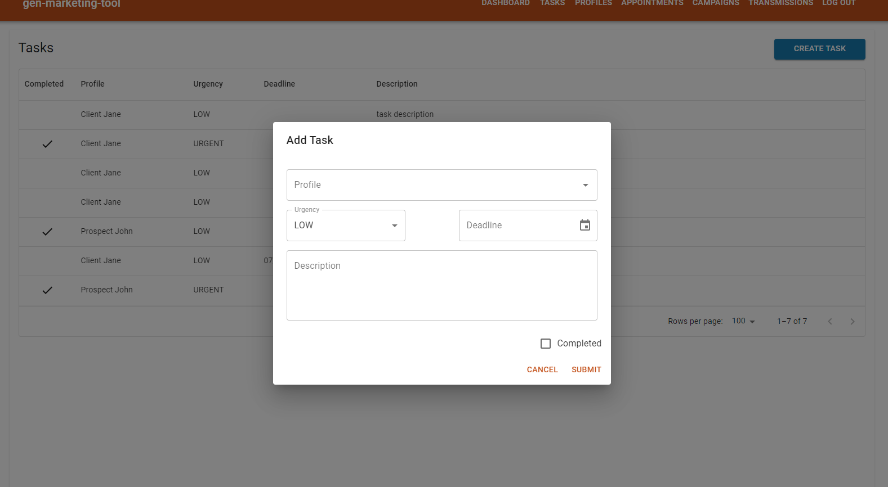
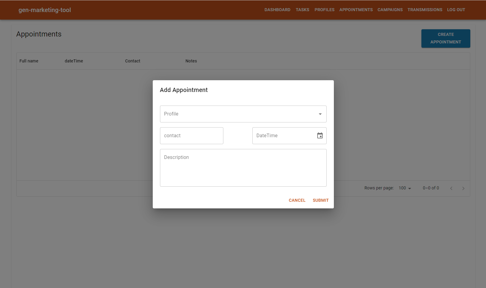

# General Marketing Tool

The General Marketing Tool is an application designed to help users manage profiles and tasks associated with those profiles. It also offers appointment management functionality, including the ability to create and manage appointments. In addition, the application plans to implement email notifications for appointment creation, campaign management features, transmission logs for emails, and a CSV download feature in the future.


## Table of Contents

- [Features](#features)
- [Technologies Used](#technologies-used)
- [Prerequisites](#prerequisites)
- [Setup Instructions](#setup-instructions)
- [Environment Variables](#environment-variables)
- [Running Tests](#running-tests)
- [Additional Information](#additional-information)

## Features

- Profile management
- Task management
- Appointment creation and management
- Email notifications (planned)
- CSV download (planned)
- Campaigns (planned)
- Transmission logs (planned)

## Technologies Used

- Typescript
- Node.js
- Postgresql
- Prisma
- JWT
- React
- Redux Toolkit
- Vite

## Prerequisites

- Node.js (Version 18.16.0)
- PostgreSQL database

## Setup Instructions

1. Clone the repository to your local machine:

```
git clone https://github.com/stephanalas/salas-marketing-tool.git
cd salas-marketing-tool
```

2. Install the required dependencies:

```
npm install
```

3. Set up the PostgresSQL database and ensure you have the connection URL ready. (I used Render.com for postgres db)

4. Create a `.env` file in the root directory of the project and add the following environment variables:

```
SECRET_KEY=your_secret_key_here
DATABASE_URL=your_database_url_here
TEST_PASSWORD=your_test_password_here
```

5. Generate prisma client, push prisma db and seed db

```
npx prisma generate
npx prisma db push
npx prisma db seed
```

6. start dev server

```
npm run dev
```

The application should now be running locally at http://localhost:5173

7. Sign in with admin@mail.com and your TEST_PASSWORD

## Environment Variables

- `SECRET_KEY`: A secret key used for JWT authentication.
- `DATABASE_URL`: The connection URL for your PostgreSQL database.
- `TEST_PASSWORD`: The password used for running tests.

  Make sure to set up these environment variables before running the application.

## Additonal Information

For any additional information or inquiries about the project, please contact stephan.j.alas@gmail.com.
